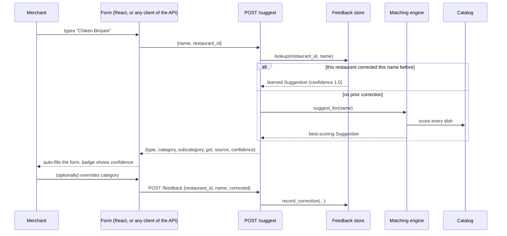

# System architecture

## Two implementations, one algorithm

```
menu-items/
├── src/            React + TypeScript prototype — published as a static
│                   Artifact preview, so it carries its own copy of the
│                   detection algorithm (no server calls possible from
│                   inside a sandboxed Artifact page).
├── backend/        Python + FastAPI reference implementation — the one
│                   meant to actually run in production. Same algorithm
│                   (see docs/ALGORITHM.md), plus backend-only features
│                   that need server-side state: duplicate detection,
│                   price sanity checks, a per-restaurant feedback loop,
│                   and real CSV/XLSX bulk import.
└── docs/           This folder.
```

The duplication is deliberate and temporary, not an oversight — see
"Single source of truth" at the bottom of this document for how a real
deployment collapses it to one.

## Request flow — adding a single item



The override step at the bottom is what turns this from a static rule
engine into something that gets better *for that restaurant* over time —
see "Feedback loop" below.

## Feature-by-feature: how each piece works

### 1. Single-item detection (`/suggest`)
Merchant types a name → `matching.suggest_for()` runs the algorithm in
`docs/ALGORITHM.md` → response includes `source` (`catalog` / `inferred` /
`manual` / `learned`) and `confidence` (0–1), which the client uses to
decide how strongly to present the auto-fill (see the badge tiers in
`src/components/AddMenuItem.tsx`, mirrored conceptually by whatever
consumes `/suggest` in a real client).

### 2. Autocomplete (`/autocomplete`)
Same catalog, different job: as the merchant types, return dish names that
start with, contain, or are a close fuzzy match to the query (so a typo
mid-word still surfaces suggestions), capped at `limit`. Picking a
suggestion is equivalent to a `confidence = 1.0` catalog match — no
scoring needed, the merchant told you directly which dish this is.

### 3. Bulk import — pasted text (`/bulk/text`)
One `POST` with a raw multi-line string. `bulk_import.parse_text()` splits
each line into `(name, price)` via regex, then `build_bulk_rows()` runs
every parsed row through `suggest_for()`, `find_duplicates()` (against
whatever's already been seen in *this batch*, since a merchant pasting a
list is the most likely place to accidentally paste the same dish twice),
and `check_price()`. The response is a row-per-line preview with every
signal a client needs to render an editable table before committing.

### 4. Bulk import — spreadsheet upload (`/bulk/file`)
The Python-only feature the pasted-text version can't cover: a real
`.csv`/`.xlsx` export from a POS system. `bulk_import.parse_spreadsheet()`
loads it with pandas, guesses which column is the name and which is the
price by matching headers against a small alias list (`"item name"`,
`"dish"`, `"product"`... for name; `"price"`, `"mrp"`, `"rate"`... for
price) rather than assuming column position, then falls through the same
`build_bulk_rows()` as the text path — one detection pipeline, two ways of
getting rows into it. Callers may also pass `existing_item_names` (as a
JSON-encoded form field) so duplicate detection checks against the
merchant's *actual current menu*, not just the batch.

### 5. Duplicate detection (`/duplicates/check`, and inline in bulk import)
Reuses `matching.name_similarity()` — the same primitive that powers
catalog matching — against a stricter threshold (0.82 vs. the ~0.3–0.55
catalog band), because "this might be the dish you meant" and "this is
probably already on your menu" are different bars. See
`backend/app/duplicates.py`.

### 6. Price sanity check (`/pricing/check`, and inline in bulk import)
Each category has an expected price band (`backend/app/pricing.py`,
currently hand-set, meant to be computed from real order history — see
Roadmap). A price far outside the band is flagged as a probable data-entry
error (missing digit, decimal slip) — never blocked, since a real premium
or budget item is valid.

### 7. Feedback loop (`/feedback`, `/feedback/catalog-gaps`)
When a merchant overrides an auto-suggestion, `POST /feedback` records
`(restaurant_id, dish_name) → corrected Suggestion`. The next time *that
restaurant* types *that dish name*, `/suggest` returns the learned
correction at confidence 1.0 instead of re-running detection — scoped per
restaurant so one merchant's correction never leaks into another's menu.
`GET /feedback/catalog-gaps` surfaces dish names that multiple *different*
restaurants have independently corrected the same way — a queue for a
human content curator to promote into the shared catalog. This is
intentionally the simplest version of a learning loop (in-memory, no
retraining); `docs/ROADMAP.md` covers what a durable version looks like.

### 8. Custom categories, availability, offers, disable/enable, photo upload
These live entirely in the frontend prototype today (`src/components/`) —
they're merchant-facing form/state concerns, not detection concerns, so
they don't have a Python counterpart yet. They become backend concerns the
moment there's a real menu-items table: category creation needs a
uniqueness check per restaurant, availability windows need a timezone-
aware scheduler for "is this item orderable right now", offers need
overlap/validity-window rules, and photo upload needs real object storage
(S3/GCS) instead of a data URL. None of that is built here — flagged in
the Roadmap as the next concrete slice of backend work.

## Testing strategy

Every module in `backend/app/` has a matching test file in
`backend/tests/`: unit tests for the pure functions (`matching`,
`duplicates`, `pricing`, `bulk_import`, `feedback`), plus
`test_api.py` exercising the FastAPI app end-to-end through
`TestClient` — including the cross-restaurant isolation guarantee for the
feedback loop, which is the one property a unit test on `FeedbackStore`
alone wouldn't catch a regression in at the API boundary.

## Deployment notes

- **CORS** is wide open (`allow_origins=["*"]`) for local development in
  `backend/app/main.py`. Lock this to the actual frontend origin(s) before
  this goes anywhere near production.
- **The feedback store is in-process memory** (`backend/app/feedback.py`)
  — it resets on restart and doesn't share state across multiple API
  instances. Fine for a single-instance prototype; needs to move to a real
  table (`restaurant_id, dish_name, corrected_json, updated_at`) before
  running behind more than one process.
- **The catalog is a bundled Python list.** At its current size (~110
  dishes) that's the right call — no infra, trivially testable. Past a few
  thousand entries, move it to Postgres and add a trigram or pgvector
  index for the fuzzy-match step; see Roadmap.

## Single source of truth

Right now the algorithm exists twice because the React prototype is
published as a static Artifact and literally cannot make network calls
(strict CSP, sandboxed origin). The moment this frontend is deployed
somewhere that *can* reach a real backend, it should stop carrying its own
`src/lib/match.ts` and call this API's `/suggest`, `/autocomplete`,
`/bulk/text` and `/bulk/file` instead — one algorithm, one place it can
drift, one place to improve it (tune thresholds, extend the catalog, wire
in the embedding matcher from the Roadmap) that immediately benefits both
the web app and any other client (a future mobile app, a merchant-support
internal tool, a WhatsApp onboarding bot) hitting the same API.
